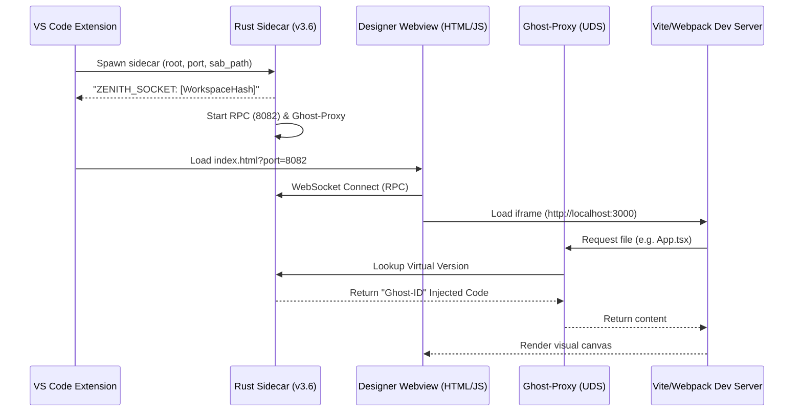

# ⬡ Zenith: Surgical Design OS — Technical Architecture & Implementation Guide

Version: v3.6.0  
Status: Active — v2.3 Ghost-Proxy Virtualization Fully Implemented  
Last Updated: 2026-03-23

---

## 1. Vision & Overview
Zenith is a high-fidelity, real-time visual design engine that bridges the gap between source code and visual manipulation. 

### 1.1 Process Orchestration & Handshake



---

## 2. Core Architecture: The "Ghost-Proxy" Model

### 2.1 Virtual File System (VFS)
*   **COW (Copy-On-Write) Overlays**: In-memory modification buffer.
*   **WAL (Write-Ahead Log)**: Logs every design intent to `.zenith/wal.log`.
*   **Ghost-ID Injection**: `swc`-powered AST transformation.

### 2.2 Hot Path (SAB Ring Buffer)
*   **SharedArrayBuffer (SAB)**: Memory bridge for 0ms-latency UI updates.

---

## 3. JSON-RPC API Reference (Port 8082)

| Method | Parameters | Return | Description |
| :--- | :--- | :--- | :--- |
| `element.select` | `ghost_id: string` | `GhostEntry` | Resolves a Ghost ID to source coordinates. |
| `zenith.engine.stage` | `intent: MutationIntent` | `boolean` | Stages mutation to COW + WAL. |

---

## 4. "Under the Hood": Binary & Logic Minute Details

### 4.1 SAB Memory Layout (Binary Structure)
The `sab.bin` (64KB default) is structured as a lock-free circular ring buffer:
*   **[0-3]**: `HEAD` pointer (u32).
*   **[4-7]**: `TAIL` pointer (u32).
*   **[8-1023]**: Status flags and session metadata.
*   **[1024-End]**: Message slots. Each slot is 128 bytes:
    *   `[0]`: Message Type (1 = CSS, 2 = State).
    *   `[1-32]`: Zenith ID Hash (blake3).
    *   `[33-64]`: Property Name (e.g., "opacity").
    *   `[65-127]`: Value Payload (f32 or short string).

### 4.2 AST Transformation (Ghost-ID Injection)
**Before (Physical Source):**
```tsx
export const Card = () => <div className="p-4">Hello</div>;
```
**After (Virtual / Proxy Output):**
```tsx
export const Card = () => <div data-zenith-id="abc123789" className="p-4">Hello</div>;
```
*Injection Technique*: The `swc` visitor identifies `opening_el` nodes and inserts a `JSXAttr` without re-formatting the surrounding code, preserving developer source mapping.

### 4.3 Sidecar Hot Path Polling
To avoid 100% CPU usage while maintaining sub-microsecond latency:
1.  **Spin-Loop**: Sidecar polls for 500ms if a message was recently received.
2.  **Adaptive Yield**: If no activity for >1s, the thread yields to the OS scheduler (`std::thread::yield_now()`).
3.  **Atomic Sync**: Uses `atomic-waker` to resume instantly when the Webview triggers a memory write.

---

## 5. Advanced Engine Mechanics

### 5.1 Conflict & OT Engine
*   **LWW (Last-Write-Wins)**: Zenith uses a vector clock to resolve simultaneous edits between the Designer UI and the IDE editor.
*   **Structural Rebase**: If the IDE moves a file, the Sidecar automatically updates the `GhostRegistry` to reflect the new absolute paths.

### 5.2 HMR Injection Pipeline
1.  **Intercept**: Ghost-Proxy catches `.tsx` request.
2.  **Synthetic HMR**: Sidecar injects `import.meta.hot.accept()`.
3.  **Virtual Flush**: Staging increments a `?z=v1` version query, triggering a surgical HMR update in the canvas.

---

## 6. VS Code Command & Interaction Registry

### 6.1 IDE Commands
| Command | Trigger | Effect |
| :--- | :--- | :--- |
| `zenith.visualEdit` | Icon | Opens/Reveals Canvas. |
| `zenith.surgicalMode.toggle`| Palette | Toggles Sidecar-driven AST patching. |

### 6.2 Extension Lifecycle
*   **`activate`**: Probes for sidecar, initializes SAB memory, mounts the `ZenithCanvasPanel`.
*   **`deactivate`**: Sends `SIGTERM` to sidecar, flushes log buffers, and unlinks the Named Pipe.

---

## 7. Error Registry & Diagnostics

| Signal | Meaning | Resolution |
| :--- | :--- | :--- |
| `ZENITH_ERROR` | Fatal sidecar crash. | Extension restarts Sidecar. |
| `ZENITH_WAL_ERROR` | Log corruption. | Sidecar wipes `wal.log`. |

### 7.2 Observability Suite (v3.8)
Zenith includes a high-fidelity "Flight Recorder" and "Audit Mode" for real-time interaction diagnostics.

*   **Alt + D (Audit Mode)**: Toggles a visual diagnostic overlay in the designer. Displays `STABLE_PATH_ID`, `REACT_FIBER_METADATA`, and the real-time `IPC_BRIDGE_PULSE`.
*   **Flight Recorder**: Persistently records all designer events to `.zenith/trace.log` in a human-friendly JSONL format. Includes timestamps, style patches, and IPC signals.
*   **Stable Path IDs**: Replaced line-based identification with AST-safe path strings (e.g. `App.tsx:Layout.Main.Button[0]`) to ensure selection stability across code edits.

---

## 8. Development Deep-Dive & Surgical Nuances (v3.8)

This section contains the "DNA" of Zenith's surgical logic, ensuring continuity for future AI assistants.

### 8.1 The Stable identifier Algorithm (Onlook Parity)
To ensure selection stays "locked" across code edits, Zenith uses **Path-JSX-Structural** IDs.
*   **Format**: `[file]:[ParentPath].[Tag]:[Index]`
*   **Logic**: The `injector.ts` traverses the AST from the node upwards, collecting the `tagName` of JSX parents until it hits the `Program` root. 
*   **Stability**: Unlike line:col, this survives file reformatting, line additions, and sibling additions of different tags.

### 8.2 The Unit-Preserving "Smart Parser"
To prevent the "Zero-Value" bug in CSS inspectors, the `PropertyEditor` uses a dual-pass parser.
*   **Split**: Uses `(\d*\.?\d+)(\D*)` to isolate the numeric amount from the unit (`rem`, `px`, `%`).
*   **Recombine**: Edits only change the numeric portion. The original unit is "Sticky," ensuring that `1.5rem` becomes `2.0rem` instead of `2px` or `0`.

### 8.3 The Hot-Path Binary Contract (SAB)
Messages in the `sab.bin` ring buffer follow a zero-allocation `repr(C)` structure for <1µs latency.
*   **ScrubMessage**:
    *   `zenith_id_hash` (u64): FNV-1a hash for fast lookup.
    *   `property_id` (u16): Maps to `PropertyId` enum (0=Padding, 10=Width, etc).
    *   `value` (f64): The raw amount.
    *   `unit` (u32): Maps to `Unit` enum (0=Px, 1=Rem, 5=TailwindStep).

### 8.4 Webview Component Map
*   `Canvas.tsx`: Hosts the ghost-iframe and the Liquid Sync overlays.
*   `InspectorPanel.tsx`: Entry point for `PropertyEditor` and `StyleScraper`.
*   `LayersPanel.tsx`: Virtual tree of the DOM hierarchy.
*   `App.tsx`: The IPC routing hub (VS Code <-> Webview <-> Iframe).

---
*Zenith — The Surgical Design OS for the Modern Web.*
