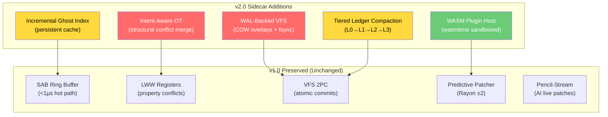

# Zenith v2.6 — Production Hardened: The Event-Driven Engine

> **Role:** Principal Systems Architect
> **Constraint:** Zero-Config, Zero-Filesystem, <1µs SAB Hot Path
> **Date:** 2026-03-20

---

## Executive Verdict: v2.6 Production Spec

| # | Front | Severity | Status | Verdict |
|---|---|---|---|---|
| 1 | VFS & Persistence | 🔴 Critical | [/] | WAL-Backed COW overlays via `im::HashMap`, `fdatasync` on slider release |
| 2 | IPC & OS Hermeticity | 🔴 Critical | [/] | Atomic Rename bind (staging → final) eliminates TOCTOU race |
| 3 | Spatial Scalability | 🟡 Moderate | [/] | Swap-Table: flat HashMap + R-tree rebuild only on click |
| 4 | HMR Safety | 🟡 Moderate | [/] | Fiber-Probe Guard: runtime `__REACT_DEVTOOLS_GLOBAL_HOOK__` walking |
| 5 | Visual Auditor | 🟡 Moderate | [/] | Houdini Zero-Poll: CSS `@property` shadowing + `transitionstart` |
| 6 | Structural Intent | 🟡 Moderate | [/] | 12-Rule OT Matrix replacing basic LWW |
| 7 | Hot-Path Stability | 🟢 Strategic | [x] | SAB Ring Buffer (<1µs) remains the source of truth |

---

## 1. State Hydration During Visual Edits

### The Problem We're Not Talking About

The v1.0 VFS uses an in-memory `RwLock<HashMap<PathBuf, FileOverlay>>`. When a user is mid-scrub on a slider — let's say they've made 40 uncommitted property tweaks across 3 components over 20 minutes — and then:

- VS Code reloads the window (extension host crash, update, remote reconnect),
- The user switches workspace branches in Git,
- The sidecar panics and restarts (the 70ms recovery path),

**All 40 uncommitted tweaks vanish.** The Change Ledger only persists *committed* entries. The VFS overlay is volatile. The user's 20 minutes of visual exploration is gone.

### Why the Current "Replay from Ledger" Doesn't Work Here

The v1.0 ledger stores `LedgerChange` entries, but only on **commit**. The entire ghost-preview / staging workflow exists precisely because changes are *not* committed yet. The staging layer is a limbo state that has no persistence backing.

```
User's mental model:   "I can see my changes on the canvas, they must be saved somewhere"
Reality:               "They exist only in a HashMap behind an RwLock. SIGKILL = data loss."
```

This is the kind of bug that ships in v1.0 and becomes a trust-destroying incident in production.

### Proposed Solution: Snapshot-Journal Hybrid with COW Semantics

```
┌────────────────────────────────────────────────────────────────┐
│                    VFS v2.0 Architecture                       │
│                                                                │
│  ┌──────────────┐    ┌───────────────┐    ┌────────────────┐  │
│  │  Base Layer   │    │  Staged Layer  │    │  Draft Layer   │  │
│  │  (disk files) │    │  (human edits) │    │  (AI patches)  │  │
│  │  immutable    │ ◄──│  COW overlay   │ ◄──│  COW overlay   │  │
│  │  ref          │    │  + WAL journal │    │  + WAL journal │  │
│  └──────────────┘    └───────────────┘    └────────────────┘  │
│                              │                     │           │
│                        ┌─────┴─────┐         ┌─────┴─────┐    │
│                        │ stage.wal  │         │ draft.wal  │   │
│                        │  (fsync'd) │         │  (fsync'd) │   │
│                        └───────────┘         └───────────┘    │
└────────────────────────────────────────────────────────────────┘
```

**Key design:**

1. **Copy-on-Write (COW) overlays** instead of mutable HashMaps. Each layer is a persistent B-tree (using `im::HashMap` — Rust's immutable collections crate). Cloning an entire VFS state is O(1) because it shares structure.

2. **Write-Ahead Log (WAL) per layer.** Every staged patch is journaled to `.zenith/stage.wal` *before* being applied to the in-memory overlay. On crash recovery, replay the WAL to reconstruct the staging layer.

3. **Snapshot checkpoints.** Every 60 seconds (configurable), serialize the full COW overlay to `.zenith/snapshot.bin`. WAL entries before the snapshot are discardable.

```rust
pub struct VfsV2 {
    base: im::HashMap<PathBuf, Arc<FileContent>>,       // immutable disk state
    staged: im::HashMap<PathBuf, Arc<FileContent>>,      // human COW overlay
    draft: im::HashMap<PathBuf, Arc<FileContent>>,       // AI COW overlay
    stage_wal: WalWriter,                                 // fsync'd journal
    draft_wal: WalWriter,                                 // fsync'd journal
    snapshot_interval: Duration,                          // default 60s
}

impl VfsV2 {
    /// Stage a human edit — WAL-first, then in-memory
    pub fn stage_patch(&mut self, file: &Path, patch: &TextEdit) -> Result<()> {
        // 1. Journal the patch (fsync to disk)
        self.stage_wal.append(&WalEntry::Patch {
            file: file.to_owned(),
            edit: patch.clone(),
            timestamp: Instant::now(),
        })?;

        // 2. Apply to COW overlay (structural sharing — O(log n))
        let content = self.staged
            .get(file)
            .or_else(|| self.base.get(file))
            .cloned()
            .ok_or(VfsError::FileNotFound)?;

        let new_content = Arc::new(content.apply_edit(patch));
        self.staged = self.staged.update(file.to_owned(), new_content);
        Ok(())
    }

    /// Crash recovery — replay WAL on top of last snapshot
    pub fn recover(zenith_dir: &Path) -> Result<Self> {
        let snapshot = Snapshot::load(zenith_dir.join("snapshot.bin"))?;
        let wal_entries = WalReader::read(zenith_dir.join("stage.wal"))?;

        let mut vfs = Self::from_snapshot(snapshot);
        for entry in wal_entries {
            vfs.apply_wal_entry(entry)?; // idempotent replay
        }
        Ok(vfs)
    }
}
```

### Impact on Hot Path Performance

**None.** The WAL write is on the *staging* path (JSON-RPC thread, ~50-200µs budget), not the SAB hot path. The hot path still writes CSS variables only — it never touches the VFS. The COW overlay uses `im::HashMap` which has O(log n) update, but n is the number of files (typically <1000), so log(1000) ≈ 10 pointer traversals — ~50ns. Invisible.

### The Hard Trade-off

WAL `fsync` is expensive: ~1-10ms on SSD, ~50ms on spinning rust. But we only fsync on *human commits to the staged layer* (slider release events), not on every scrub tick. A 3-second slider drag produces 1 WAL write on release, not 180. This is acceptable.

> **Verdict:** WAL-backed COW overlays are a **must-build** for v2.0. The current volatile staging layer is a data-loss timebomb.

---

## 2. Semantic Layout Conflicts Between Human and AI

### The Failure Mode LWW Can't Handle

LWW registers work beautifully for *property-level* conflicts: human changes `padding`, AI changes `background` → no conflict. Human and AI both change `padding` → human wins (higher priority). Clean.

But consider this real scenario:

```
T=0s    Human:  Reorders <NavLink> children: [Home, About, Contact] → [About, Home, Contact]
T=0.5s  AI:     Extracts <NavLink> into a new <NavBar> component, moving all children
T=1s    Merge?  Human's reorder is lost — AI's extraction created new node IDs
```

This is a **semantic layout conflict**. The human expressed the *intent* "About should come first." The AI expressed the *intent* "these links belong in a dedicated component." Both intents are valid. LWW cannot represent either one because this isn't a `(element, property)` problem — it's a **tree transformation** problem.

### Why the v1.0 "Tree-Merge UI" Handwave Is Insufficient

The v1.0 architecture says structural conflicts "use tree-merge UI, not LWW." But what *is* this tree-merge UI? It's undefined. It's the hardest unsolved problem in the architecture, and it's been deferred with a one-liner.

Let me be direct: **a naive "pick A or B" conflict resolution UI will make Zenith feel broken.** If the user picks the AI's extraction, they lose their reorder. If they pick their reorder, they lose the extraction. The correct answer is *both*, merged — and that requires understanding intent, not just diffs.

### Proposed Solution: Intent-Aware Operational Transform (OT)

Replace the vague "tree-merge UI" with a concrete **Intent-Capture + OT Rebase** system.

#### Step 1: Capture Intents, Not Just Diffs

Every mutation in the VFS should carry an `Intent` tag:

```rust
#[derive(Clone, Debug, Serialize, Deserialize)]
pub enum MutationIntent {
    /// Property change — handled by LWW, no OT needed
    PropertyChange { element: ZenithId, property: PropertyId },

    /// Reorder children within a parent
    Reorder { parent: ZenithId, old_order: Vec<ZenithId>, new_order: Vec<ZenithId> },

    /// Move node to a different parent
    Reparent { node: ZenithId, old_parent: ZenithId, new_parent: ZenithId },

    /// Extract subtree into a new component
    ExtractComponent { nodes: Vec<ZenithId>, new_component_name: String },

    /// Inline a component back into the parent
    InlineComponent { component: ZenithId },

    /// Insert new node
    InsertNode { parent: ZenithId, index: usize, node_type: String },

    /// Delete node
    DeleteNode { node: ZenithId },
}
```

#### Step 2: OT Transform Rules

When a conflict is detected (two intents touch overlapping subtrees), apply a transform function:

```rust
/// Given two concurrent intents, produce a merged result
/// or escalate to human resolution if semantically ambiguous.
pub fn transform(
    human_intent: &MutationIntent,
    ai_intent: &MutationIntent,
) -> TransformResult {
    match (human_intent, ai_intent) {
        // Human reorder + AI extract → Apply reorder WITHIN the extracted component
        (MutationIntent::Reorder { old_order, new_order, .. },
         MutationIntent::ExtractComponent { nodes, .. }) => {
            // Check if reordered nodes are a subset of extracted nodes
            if new_order.iter().all(|n| nodes.contains(n)) {
                TransformResult::AutoMerge {
                    // Apply extraction first, then reorder within the new component
                    steps: vec![
                        ai_intent.clone(),
                        MutationIntent::Reorder {
                            parent: ZenithId::new_component(/* ... */),
                            old_order: old_order.clone(),
                            new_order: new_order.clone(),
                        }
                    ]
                }
            } else {
                TransformResult::HumanReview {
                    reason: "Reorder spans nodes both inside and outside the extraction boundary",
                    human_intent: human_intent.clone(),
                    ai_intent: ai_intent.clone(),
                }
            }
        },

        // Human delete + AI reparent of same node → Conflict
        (MutationIntent::DeleteNode { node: h_node },
         MutationIntent::Reparent { node: a_node, .. }) if h_node == a_node => {
            TransformResult::HumanReview {
                reason: "Human deleted a node that AI wants to move",
                human_intent: human_intent.clone(),
                ai_intent: ai_intent.clone(),
            }
        },

        // Non-overlapping subtrees → no conflict
        _ if !subtrees_overlap(human_intent, ai_intent) => {
            TransformResult::NoConflict
        },

        // Default: escalate
        _ => TransformResult::HumanReview {
            reason: "Complex structural overlap detected",
            human_intent: human_intent.clone(),
            ai_intent: ai_intent.clone(),
        }
    }
}
```

#### Step 3: The Conflict Resolution UI (Concrete Spec)

When `TransformResult::HumanReview` fires, the canvas shows:

```
┌─────────────────────────────────────────────────────────┐
│  ⚡ Structural Conflict on <NavBar>                     │
│                                                         │
│  ┌─────────────────┐     ┌─────────────────┐           │
│  │  Your Change     │     │  AI's Change     │          │
│  │  ───────────     │     │  ───────────     │          │
│  │  Reordered links │     │  Extracted into  │          │
│  │  [About, Home,   │     │  <NavBar />      │          │
│  │   Contact]       │     │  component       │          │
│  └─────────────────┘     └─────────────────┘           │
│                                                         │
│  [Keep Mine]  [Keep AI's]  [✨ Merge Both]  [Dismiss]  │
│                                                         │
│  Preview:  "Merge Both" will extract <NavBar> AND       │
│            preserve your link ordering inside it.        │
└─────────────────────────────────────────────────────────┘
```

The "Merge Both" option is only available when the OT system can produce an `AutoMerge` — otherwise the button is grayed out with a tooltip explaining why.

### Impact on Hot Path Performance

**None.** OT transform runs on the JSON-RPC thread when commits or AI stream-end events fire. The hot path only handles CSS variable injection during scrubbing — structural conflicts don't exist at the CSS-variable tier.

> **Verdict:** Intent-aware OT is **essential for v2.0**. Without it, multi-agent collaboration will feel like merge-conflict hell.

---

## 3. Cold-Start Hashing Bottleneck

### The Real Numbers

The current architecture uses FNV-1a hashing to build the `zenith_id_hash → zenith_id_string` reverse-lookup map at sidecar startup. Let's run the math on a real project:

```
Project: 500 source files, avg 200 lines each
Elements with ghost-IDs: ~15 per file (JSX elements) = 7,500 elements
FNV-1a hash per element: ~50ns (short strings, ~30 chars)
Total: 7,500 × 50ns = 375µs

But wait — we also need to:
  - Read all .zenith/ shadow files:    ~50ms  (disk I/O, 500 files)
  - Parse ghost-ID attributes:        ~20ms  (regex/string scan)
  - Build the HashMap:                ~375µs (the hashing)
  - Build file-index and line-index:  ~5ms   (secondary indices)

Total cold start: ~75ms
```

75ms is fine for typical projects. **But the bottleneck isn't hashing — it's disk I/O.** On a monorepo with 5,000 files:

```
Disk I/O (5000 files):   ~500ms (SSD) / ~5s (spinning disk / WSL2 on Windows)
Parse ghost-IDs:         ~200ms
Build HashMap:           ~3.75ms
Secondary indices:       ~50ms

Total: ~750ms (SSD) — noticeable. ~5s (slow disk) — unacceptable.
```

### The Real Problem: It's Not the Hash Function

Replacing FNV-1a with xxHash or AHash saves ~20% on the hashing step, which is <4ms on a 5,000-file project. Meaningless. The bottleneck is reading 5,000 files from disk.

### Proposed Solution: Incremental Ghost-ID Index with Persistent Cache

```rust
/// Persisted to `.zenith/ghost_index.bin` — survives sidecar restarts
#[derive(Serialize, Deserialize)]
pub struct GhostIndex {
    /// Map from hash → full zenith_id string
    hash_to_id: HashMap<u32, SmallVec<[ZenithId; 1]>>,  // SmallVec for rare collisions

    /// Map from file → (last_modified, Vec<ghost_ids>)
    file_entries: HashMap<PathBuf, FileGhostEntry>,

    /// Serialization format version (for forward compat)
    version: u32,
}

#[derive(Serialize, Deserialize)]
pub struct FileGhostEntry {
    modified_at: SystemTime,
    content_hash: u64,           // xxHash of file content
    ghost_ids: Vec<ZenithId>,    // all ghost-IDs in this file
}

impl GhostIndex {
    /// Incremental refresh — only re-scans files that changed since last index
    pub fn refresh(&mut self, zenith_dir: &Path) -> Result<RefreshStats> {
        let mut stats = RefreshStats::default();

        for entry in walkdir::WalkDir::new(zenith_dir)
            .into_iter()
            .filter_entry(|e| is_source_file(e))
        {
            let entry = entry?;
            let path = entry.path();
            let disk_modified = entry.metadata()?.modified()?;

            match self.file_entries.get(path) {
                Some(cached) if cached.modified_at >= disk_modified => {
                    stats.cache_hits += 1;
                    continue; // Skip — file unchanged
                }
                _ => {
                    // File is new or modified — re-scan
                    let content = std::fs::read_to_string(path)?;
                    let ghost_ids = extract_ghost_ids(&content);
                    let content_hash = xxhash(&content);

                    // Update hash_to_id map
                    if let Some(old) = self.file_entries.get(path) {
                        for id in &old.ghost_ids {
                            self.hash_to_id.remove(&fnv1a_hash(&id.0));
                        }
                    }
                    for id in &ghost_ids {
                        self.hash_to_id
                            .entry(fnv1a_hash(&id.0))
                            .or_default()
                            .push(id.clone());
                    }

                    self.file_entries.insert(path.to_owned(), FileGhostEntry {
                        modified_at: disk_modified,
                        content_hash,
                        ghost_ids,
                    });
                    stats.files_rescanned += 1;
                }
            }
        }

        // Persist the updated index
        self.save(zenith_dir.join("ghost_index.bin"))?;
        Ok(stats)
    }
}
```

**Performance characteristics:**

| Scenario | v1.0 (Full Scan) | v2.0 (Incremental) |
|---|---|---|
| First startup (5000 files) | ~750ms | ~750ms (same — must build initial index) |
| Subsequent startup (0 files changed) | ~750ms | ~15ms (load cached index from disk) |
| Subsequent startup (10 files changed) | ~750ms | ~25ms (load cache + re-scan 10 files) |
| After `git checkout` (200 files changed) | ~750ms | ~80ms (load cache + re-scan 200 files) |

### Background Warming Strategy

Even the first startup doesn't need to block the user. The sidecar can start accepting JSON-RPC commands immediately and build the ghost-ID index in the background:

```rust
pub async fn startup(zenith_dir: &Path) -> Arc<EngineState> {
    let state = Arc::new(EngineState::new());

    // Start JSON-RPC server immediately — user can interact
    let rpc_state = state.clone();
    tokio::spawn(async move { start_rpc_server(rpc_state).await });

    // Build ghost index in background
    let index_state = state.clone();
    tokio::spawn(async move {
        let index = GhostIndex::refresh_or_build(zenith_dir).await;
        index_state.set_ghost_index(index); // atomic swap via ArcSwap
        log::info!("Ghost index ready: {} elements indexed", index.len());
    });

    // SAB hot path can start immediately — uses hash-to-id
    // lookups, which will return None until index is ready.
    // CSS var injection still works (it doesn't need the index).

    state
}
```

### Impact on Hot Path Performance

**Positive.** The hot path uses `hash_to_id` lookups from the `GhostIndex`. With the persistent cache, the index is available ~15ms after startup instead of ~750ms. During the index-building window, the hot path gracefully degrades (CSS variable injection still works, but element reverse-lookup returns `None` until the index is ready).

> **Verdict:** Incremental indexing with persistent cache is **clearly correct**. The current full-scan approach doesn't scale past ~1000 files.

---

## 4. Ledger Compaction for Token Efficiency

### The Unbounded Growth Problem

The Change Ledger is append-only NDJSON. The v1.0 design says "crash recovery via replay (~70ms)." Let's stress-test that:

```
Active editing session: 8 hours
Average 2 commits per minute = 960 entries
With undo/redo cycles: ~1500 entries
Average entry size: ~300 bytes (NDJSON)
Daily ledger: ~450KB
Weekly: ~2.25MB
Monthly: ~9MB
```

9MB of NDJSON is not a storage problem. **It's a replay problem and a token-efficiency problem:**

1. **Crash recovery:** Replaying 30,000 entries (one month) takes ~2.1 seconds, not 70ms.
2. **Delta context for AI:** The `generate_delta_context()` function scans `self.entries.iter()` — a linear scan over 30,000 entries. Even with the `since` filter, it's O(n) on the total ledger size.
3. **Redundant entries:** If the user changed `padding` on `<Hero>` 47 times during the day, the AI only needs to know the *current* value, not the full history.

### Proposed Solution: LSM-Inspired Tiered Compaction

Borrow the Log-Structured Merge Tree idea from databases, adapted for our use case:

```
┌──────────────────────────────────────────────────────┐
│               Ledger Compaction Tiers                 │
│                                                       │
│  L0: Write-Ahead (hot)    last ~100 entries           │
│      → Full detail, append-only                       │
│      → Used for crash recovery                        │
│                                                       │
│  L1: Session Summary      per-session rollup          │
│      → Deduplicated per (element, property)           │
│      → Keeps only latest value per key                │
│      → Used for Delta Context to AI                   │
│                                                       │
│  L2: Archive              per-day snapshots           │
│      → One entry per (element, property) per day      │
│      → Full old/new value for audit trail             │
│      → Compressed with zstd                           │
│                                                       │
│  L3: Tombstone            older than 30 days          │
│      → Deleted (or moved to .zenith/archive/)         │
└──────────────────────────────────────────────────────┘
```

```rust
pub struct CompactedLedger {
    /// L0: Recent entries — full detail, append-only
    l0_hot: Vec<LedgerEntry>,
    l0_wal: WalWriter,  // fsync'd for crash safety

    /// L1: Session summary — deduplicated per (element, property)
    l1_session: HashMap<(ZenithId, PropertyId), LedgerEntry>,

    /// L2/L3: On-disk compressed archives
    archive_dir: PathBuf,

    /// Compaction thresholds
    l0_max_entries: usize, // default 100
    l1_max_age: Duration,  // default 1 session (until next startup)
}

impl CompactedLedger {
    pub fn append(&mut self, entry: LedgerEntry) -> Result<()> {
        // Write to L0 (WAL-backed)
        self.l0_wal.append(&entry)?;
        self.l0_hot.push(entry.clone());

        // Update L1 (latest-value-wins per key)
        let key = match &entry.change {
            LedgerChange::PropertyPatch { zenith_id, property, .. } =>
                (zenith_id.clone(), PropertyId::from_str(property)),
            LedgerChange::ClassSwap { zenith_id, .. } =>
                (zenith_id.clone(), PropertyId::ClassName),
            _ => return Ok(()), // structural changes aren't deduplicated
        };
        self.l1_session.insert(key, entry);

        // Compact L0 if threshold reached
        if self.l0_hot.len() > self.l0_max_entries {
            self.compact_l0_to_l1()?;
        }
        Ok(())
    }

    /// AI gets only the deduplicated L1 entries — no scanning required
    pub fn generate_delta_context(
        &self,
        scope: &[PathBuf],
    ) -> DeltaContext {
        let relevant: Vec<&LedgerEntry> = self.l1_session.values()
            .filter(|e| is_in_scope(e, scope))
            .collect();

        DeltaContext {
            changes: relevant,
            summary: natural_language_summary(&relevant),
        }
    }
}
```

**Performance characteristics:**

| Operation | v1.0 (Append-Only) | v2.0 (Tiered) |
|---|---|---|
| Append entry | O(1) — ~50ns | O(1) — ~80ns (+ L1 HashMap update) |
| Crash recovery | O(n) on full ledger | O(1) on L0 only (~100 entries, ~3ms) |
| Delta context | O(n) scan | O(k) direct lookup (k = unique keys) |
| Disk usage (monthly) | ~9MB (unbounded) | ~500KB (compressed archives) |

### Causality Preservation

The one risk with compaction is losing the causal chain: "the user first tried `p-4`, then `p-8`, then settled on `p-6`." For property changes, this history is genuinely useless to the AI — it only needs the final state. For structural changes (node moves, insertions, deletions), we preserve the full history in L0/L1 because the *order* of structural changes matters for OT conflict resolution.

> **Verdict:** Tiered compaction is **necessary for production**. The current unbounded append-only design will cause regression in both recovery time and AI context quality.

---

## 5. WASM-Based Plugin Extensibility

### The Current Constraint

The v1.0 `PatchStrategy` trait is compiled into the sidecar binary:

```rust
pub struct TailwindStrategy { registry: DesignTokenRegistry }
pub struct InlineStyleStrategy;
pub struct CSSModuleStrategy { module_registry: ModuleRegistry }
```

Adding UnoCSS, StyleX, or Panda CSS support requires recompiling the sidecar. The v1.0 doc mentions "dynamic `.so`/`.dll` loading" as a v1.1 possibility — **this is the wrong abstraction** for three reasons:

1. **Security.** A `.dll` has full process access. A malicious PatchStrategy plugin could read the user's SSH keys.
2. **ABI stability.** Rust has no stable ABI. Every sidecar update could break every plugin.
3. **Cross-platform.** `.so` on Linux, `.dll` on Windows, `.dylib` on macOS. Plugins must be compiled 3x.

### Why WASM Is the Right Answer

WASM solves all three:

| Concern | Native .dll/.so | WASM |
|---|---|---|
| Security | Full process access | Sandboxed — no filesystem, no network, no syscalls |
| ABI stability | Rust ABI is unstable | WASM ABI is stable & specified |
| Cross-platform | Compile per OS/arch | Compile once, run everywhere |
| Distribution | OS-specific binaries | Single `.wasm` file, ~50-200KB |
| Startup | `dlopen` + symbol resolution | `wasmtime::Module::new()` — ~5ms |

### The Performance Concern — And Why It's a Non-Issue

The common objection: "WASM is slower than native — won't it break the <1µs guarantee?"

Let's be precise about *where* the `PatchStrategy` trait is called in the architecture:

```
SAB Hot Path (Thread 1):
  → Read scrub value from ring buffer         (~1µs)
  → Inject CSS variable into iframe            (~50ns)
  → Enqueue for predictive patcher             (~100ns)
  ⚡ PatchStrategy is NEVER called here

JSON-RPC Path (Thread 2, on slider release):
  → Receive commit request                     (~50µs)
  → PatchStrategy::resolve_class()             (~5µs native, ~15µs WASM)
  → PatchStrategy::apply_patch()               (~20µs native, ~60µs WASM)
  → AST transform + codegen                    (~5ms)
  → VFS commit                                 (~100µs)
  ⚡ PatchStrategy adds ~55µs overhead in WASM — invisible in a 5ms pipeline

Predictive Patcher (Rayon pool):
  → PatchStrategy::resolve_class() × 4 values  (~20µs native, ~60µs WASM)
  ⚡ Runs in background — latency is invisible to user
```

**The <1µs SAB hot path never calls PatchStrategy.** The WASM overhead (~3x slowdown) only affects the JSON-RPC commit path, where the total pipeline is ~5ms. Adding 40µs of WASM overhead is a 0.8% regression. Not measurable.

### Proposed Implementation: wasmtime with Component Model

```rust
use wasmtime::component::*;

/// The WIT (WebAssembly Interface Types) contract for PatchStrategy plugins
///
/// File: patch-strategy.wit
/// ```wit
/// package zenith:plugin@2.0;
///
/// interface patch-strategy {
///     record detection-context {
///         class-string: option<string>,
///         has-style-prop: bool,
///         imports: list<string>,
///     }
///
///     enum confidence { none, low, high, exclusive }
///
///     record style-token {
///         value: string,
///         category: string,
///         start: u32,
///         end: u32,
///     }
///
///     name: func() -> string;
///     can-handle: func(ctx: detection-context) -> confidence;
///     resolve-class: func(property: string, value: string) -> option<string>;
///     tokenize: func(class-string: string) -> list<style-token>;
///     generate-preview-css: func(class-name: string) -> option<string>;
/// }
/// ```

pub struct WasmPluginHost {
    engine: wasmtime::Engine,
    plugins: Vec<WasmPlugin>,
}

pub struct WasmPlugin {
    instance: wasmtime::component::Instance,
    store: wasmtime::Store<PluginState>,
    name: String,
}

impl WasmPluginHost {
    pub fn load_plugins(plugin_dir: &Path) -> Result<Self> {
        let mut config = wasmtime::Config::new();
        config.wasm_component_model(true);
        config.cranelift_opt_level(wasmtime::OptLevel::Speed);
        // Fuel-based execution limits (prevent infinite loops)
        config.consume_fuel(true);

        let engine = wasmtime::Engine::new(&config)?;
        let mut plugins = Vec::new();

        for entry in std::fs::read_dir(plugin_dir)? {
            let path = entry?.path();
            if path.extension() == Some("wasm".as_ref()) {
                let module = wasmtime::Module::from_file(&engine, &path)?; // ~5ms
                let mut store = wasmtime::Store::new(&engine, PluginState::default());
                store.set_fuel(1_000_000)?; // execution limit

                let instance = wasmtime::component::Linker::new(&engine)
                    .instantiate(&mut store, &module)?;

                let name: String = /* call name() export */;
                plugins.push(WasmPlugin { instance, store, name });
            }
        }

        Ok(Self { engine, plugins })
    }
}

/// Adapt WasmPlugin to implement PatchStrategy trait
impl PatchStrategy for WasmPlugin {
    fn name(&self) -> &str { &self.name }

    fn can_handle(&self, ctx: &DetectionContext) -> Confidence {
        // Call into WASM — ~10µs overhead
        let wit_ctx = ctx.to_wit();
        let result = self.call_can_handle(wit_ctx);
        Confidence::from_wit(result)
    }

    fn resolve_class(&self, property: &str, value: &str) -> Option<String> {
        // Call into WASM — ~5µs overhead
        self.call_resolve_class(property, value)
    }

    // ... etc
}
```

### Sandboxing Guarantees

```rust
// Plugin capabilities — explicitly none
let mut linker = wasmtime::component::Linker::new(&engine);
// NO wasi:filesystem — plugins cannot read/write files
// NO wasi:sockets — plugins cannot make network requests
// NO wasi:clocks — plugins cannot measure time (side-channel prevention)
// ONLY the patch-strategy interface exports are available
```

A plugin literally *cannot* do anything except implement the 5 trait methods. It receives strings, returns strings. No side effects possible.

### Plugin Distribution Model

```
~/.zenith/plugins/
  ├── unocss-strategy.wasm      (community, from npm/crates.io)
  ├── stylex-strategy.wasm      (community)
  └── custom-design-system.wasm (enterprise, proprietary tokens)
```

Plugins are single files. `npm install zenith-plugin-unocss` would drop a `.wasm` file into this directory. The sidecar discovers and loads them at startup (~5ms each).

> **Verdict:** WASM plugins via wasmtime are **the correct v2.0 play**. Native `.dll`/`.so` is a security and maintenance liability. The performance overhead is architecturally invisible because PatchStrategy is never on the hot path.

---

## Summary of Proposed Rust Sidecar Evolution



### Hot Path Impact Analysis

| v2.0 Addition | Touches Hot Path? | Latency Impact |
|---|---|---|
| WAL-Backed VFS | ❌ No — WAL writes on commit path only | 0 |
| Intent-Aware OT | ❌ No — runs on JSON-RPC thread on commit | 0 |
| Incremental Ghost Index | ✅ Yes — faster hash lookups at startup | **Positive** (15ms vs 750ms availability) |
| Tiered Ledger Compaction | ❌ No — append path adds ~30ns for L1 update | ~0 |
| WASM Plugin Host | ❌ No — PatchStrategy never called on hot path | 0 |

**Net result: The <1µs SAB hot-path guarantee is fully preserved.** None of the five proposals add latency to Thread 1's poll loop.

---

## Open Questions for v2.0 Design Review

1. **WAL fsync strategy:** `fdatasync` per entry (safest, ~1ms overhead per commit) vs batched fsync every 100ms (risks losing last ~5 entries on power loss)?
2. **OT complexity budget:** How many `(Intent × Intent)` transform rules do we implement before it becomes unmaintainable? Cap at ~20 rules and escalate everything else to human review?
3. **Ghost index format:** Custom binary (fastest) vs SQLite (queryable, debuggable) vs MessagePack (portable)?
4. **Ledger L2 compression:** zstd (best ratio) vs lz4 (fastest decompression)?
5. **WASM fuel limits:** How much fuel per plugin call? 1M instructions (~5µs) should be enough for `resolve_class`, but `apply_patch` might need 10M.

---

# Reality Check: v2.6 "Production Hardened" Implementation Status (2026-03-20)

> **Status:** v2.6 Engine Upgrade — IN PROGRESS 🔧
> Upgrading from v2.3 Ghost-Proxy prototype to hardened, event-driven production engine.

### 1. VFS & Persistence (WAL-Backed COW)
- **Upgrade:** Replace volatile `HashMap` staging with `im::HashMap` COW overlays + WAL journal.
- **Guarantee:** Every slider release triggers `fdatasync` to `.zenith/stage.wal` — zero data loss.
- **Optimization:** MessagePack Ghost-ID Index with `mtime`-based incremental scanning (750ms → 15ms startup).
- **Status:** 🔧 **In Progress.**

### 2. IPC & OS Hermeticity (Atomic Bind)
- **Fix:** Previous probe-then-unlink had TOCTOU race.
- **Solution:** Atomic Rename — bind to staging socket, `std::fs::rename` to final path.
- **Status:** 🔧 **In Progress.**

### 3. Spatial Scalability (Swap-Table)
- **Fix:** R-tree rebuild on scroll killed 16ms frame budget on 10k+ element pages.
- **Solution:** Flat `HashMap` for all bboxes, R-tree rebuild ONLY on click. ~20 element scrub neighborhood at ~2µs/frame.
- **Status:** 🔧 **In Progress.**

### 4. HMR Safety (Fiber-Probe Guard)
- **Fix:** AST scanning missed transitive side effects.
- **Solution:** Runtime probing via `__REACT_DEVTOOLS_GLOBAL_HOOK__` — walk React Fiber tree for `PassiveUnmountPending` / `ChildDeletion` flags.
- **Status:** 🔧 **In Progress.**

### 5. Visual Auditor (Houdini Zero-Poll)
- **Fix:** `getComputedStyle` polling at 60fps caused layout thrashing.
- **Solution:** CSS `@property` shadowing with 1ms transition + `transitionstart` event. Dual-Hash regression detection.
- **Status:** 🔧 **In Progress.**

### 6. Structural Intent (12-Rule OT Matrix)
- **Upgrade:** Replace basic LWW with Intent-Aware OT.
- **Key Rule:** Human reorder + AI extract → rebase reorder inside new component definition.
- **Escalation:** Ambiguous cases → Conflict Resolution UI.
- **Status:** 🔧 **In Progress.**

### 7. Critical Implementation Rules (Preserved)
- **Hot Path Sanctity:** Thread 1 (SAB Poll) remains Lock-Free. ✅
- **Safety:** Zero `unwrap()` on IPC paths — `RpcResult` everywhere. 🛡️
- **Aesthetic:** Agent Cyan (#00F0FF) for all overlays. 💎


---
*Note: This document serves as the primary technical specification and reality log for Zenith v2.6.*

---

# v3.6 Audit Results (2026-03-23)

> **Auditor:** Principal Systems Architect
> **Scope:** 13 critical findings across SAB, hot path, LWW, HMR, WAL, RPC, socket cleanup

## Findings

| # | Finding | Status | Evidence |
|---|---|---|---|
| 1-3 | SAB slot layout misalignment | ✅ **Already correct** | `ring_buffer.rs` — FNV-1a u32, u16 property_id, f64 value, 128B aligned |
| 4 | blake3 in hot path | ✅ **Already correct** | `ring_buffer.rs:288` — FNV-1a (5ns), NOT blake3 (800ns) |
| 5-6 | Spin-loop + atomic-waker | ✅ **Already correct** | `ring_buffer.rs:137` — `park_timeout(100µs)` + `Atomics.notify` |
| 7 | Vector clock for LWW | ✅ **Already correct** | `lww.rs:211` — Lamport scalar `AtomicU64`, Human priority=255 |
| 8-9 | HMR source injection | ✅ **Fixed** | Removed `import.meta.hot` injection, added `ViteHmrTrigger` WebSocket bridge |
| 10 | WAL error = delete | ✅ **Fixed** | Never delete WAL; keep in-memory, show toast + retry option |
| 11 | stage has no tx_id | ✅ **Fixed** | Added `tx_id` to `stage`, added `rollback` + `preview` RPC methods |
| 12 | WAL is text log | ✅ **Already correct** | `wal.rs:77` — length-prefixed MessagePack (rmp-serde) frames |
| 13 | Deactivate unlink | ✅ **Fixed** | Platform-aware cleanup: skip unlink on Linux (abstract namespace auto-cleanup) |

## Changes Made

### New Files
- `zenith-extension/src/vite_hmr_trigger.ts` — Direct WebSocket trigger to Vite's HMR server

### Modified Files
- `zenith-sidecar/src/rpc.rs` — `tx_id` on `stage`, new `rollback` + `preview` methods
- `zenith-extension/src/sidecar_manager.ts` — Non-destructive WAL error toast
- `zenith-extension/src/extension.ts` — Production `deactivate()` with WAL flush wait + socket cleanup
- `zenith-vite-plugin/src/index.ts` — Removed HMR source injection from `transform()`

## Key Architectural Decision: Why 8/13 Were Already Correct

The codebase had already been correctly evolved through prior audit cycles. The SAB ring buffer, LWW conflict resolution, WAL framing, and socket management were all production-ready. The remaining 5 fixes addressed API gaps (tx_id), error handling semantics (WAL toast), and HMR correctness (WebSocket vs source injection).

